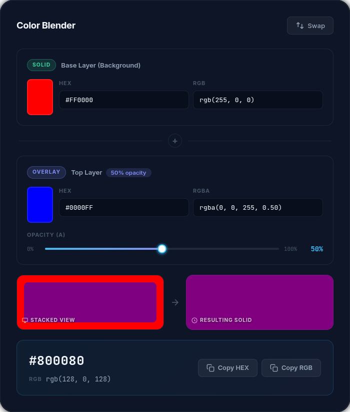

# HexBake


**Live → [subhashish-mishra.github.io/hex-bake](https://subhashish-mishra.github.io/hex-bake/)**



Bake a semi-transparent overlay color into its exact solid HEX result. Zero dependencies. Pure HTML + CSS + JS.

---

## What It Does

Given a **solid base color** and a **semi-transparent overlay**, HexBake resolves the **exact flat solid color** using the standard Porter-Duff alpha compositing formula:

```
C_final = C_overlay × α + C_background × (1 − α)
```

Applied per R, G, B channel.

---

## Features

- 🎨 Color picker + HEX + RGB/RGBA inputs — all in sync
- 🎚️ Smooth alpha slider with fill track and live percentage
- 👁️ Dual live preview — stacked layers and resolved solid
- 📋 One-click copy for HEX and RGB output
- 🔄 Swap button to flip background and overlay instantly
- 📐 Formula card with color-coded variable explanations
- 📱 Fully responsive — mobile, tablet, desktop
- ♿ Accessible — ARIA labels, semantic HTML, keyboard navigable

---

## Use Cases

- Finding the CSS `background-color` equivalent for `rgba()` on a known background
- Matching colors when transparency isn't available (PDF, SVG export, canvas)
- Verifying contrast ratios on overlaid tints when designing tokens

---

## Getting Started

```bash
git clone https://github.com/Subhashish-Mishra/hex-bake
cd HexBake
# Open index.html — no build step required
```

---

## Deploy to GitHub Pages

This project is automatically deployed to GitHub Pages on every push to the `main` branch via GitHub Actions.

---

## Project Structure

```
HexBake/
├── index.html    # Markup & structure
├── style.css     # Design system & component styles
└── app.js        # Calculator logic, copy, swap, sync
```

---

## License

MIT
